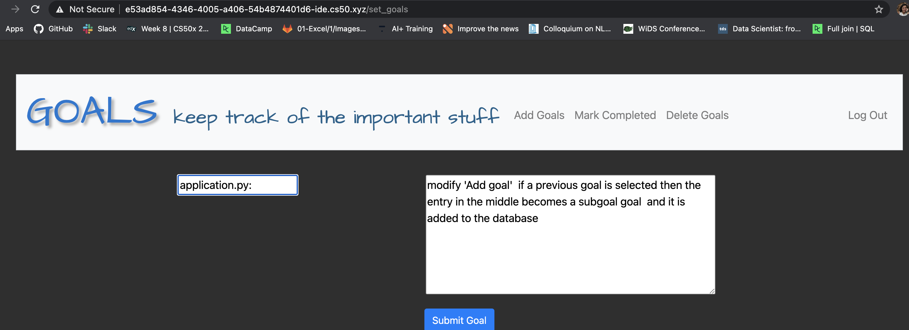

# GOAL TRACKING V 1.0

V 1.0 :initial release of a web application to track project goals.

##GOAL
The goal of this project is create web application using Flask to track project goals using login functionality. 

## STEPS to create a Web Application
The following steps are normally followed: 1) define the user goals and developer goals, 2) design the API, 3) implementation, 4) testing, 5) monitoring and iteration.

Althought this is a very simple web application, I found very useful to think about each step as it was a product to be released. With this in mind, the user's goals and requirements were scale down to be able to "release" a working version. 

1) defining the goal/s 
- an application that will track user goals along with some comments.
- application should be personalized and secure

2)Design
When designing an application, regardles of the architectural style, there are several requirements to take into account: security, reliability, scalability, testability, and usability. 
In this case I used REST architecture. It is easy and relies on HTTP protocol. It follows six constrains (Separation of client and server, Statelessness, Multiple communication layers between server and client, Uniform UI, Code on request). Security is also an important part of the design (user identification, autentication, autorization and encryption) 

## Build API
It is time to build this basic application. The application should have endpoints that are nouns '/www.website.com/index' and the verb part is in the HTTP methods and headers such as GET or POSt. The exceptions and errors should be also be handled. A list of status codes can be found . Other elements to consider are caching, performance optimization, documentation, versions.. 

Flask web aplication distribuyion code:

  - application.py (or app.py) contains the python code controling the application
  - requirements.txt contains a list of all libraries
  - goals.db contains the SQL tables users and goals (sqlite3 in this case)
  - statics/ folder with all static code like styles.css and images
  - templates/ folder with the different routes .html

One of the common design patters is MVC - Model View Controller -
    - Model: contains the application data (sql database)
    - View: presents the model data to the user ( the html pages)
    - Controller: the piece connecting view and model (the application.py)

  

I used CD50 IDE. It will only required instalation and it can be runned on your local host http://localhost:8080/.

## Run flask application

In this applcation, I am using "GET" and "POST", and templates like layout.html and it was written following Prof Malan lecture (CS50 Lecture9 Flask).

 
 First I will need to register because I am a new user
 
 
 
 Once register I can add the goals by going to Add Goals
 

Goals can be modified and marked as done or erased in similar way. This will modify the goals dataset accordingly.

 

Response Codes: Responses from the server contain status codes to alert the user. A list of status code can be found . 

## Important Security Considerations 

The passwords from the users are hashed before saved using . Passwords are never directly stored. 
To ensure privacy of the data the application uses POST requests.

## Conclusions
This first version covers:
  - security issues such as how to hash passwords prior to saving in the database and how to use POST request to ensure privacy.
  - (simplistic) error reporting of user errors that can be easily recogniced. 
  - web application design using Bootstrap  
### Next steps for V 1.1 
Usage of Postgress and SQLAlchemy libraries instead of CS50 libraries. Reactive JS 

## Acnowledgements
Thanks to Prof. David Malan, Brian Yu and Doug Lloyd from CS50
